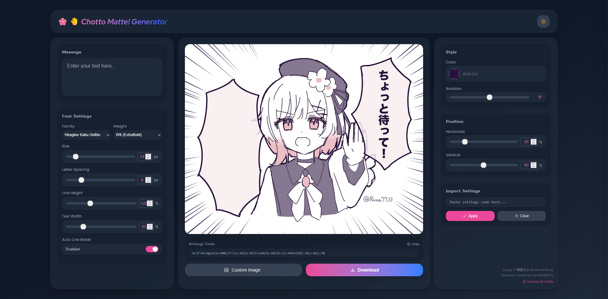
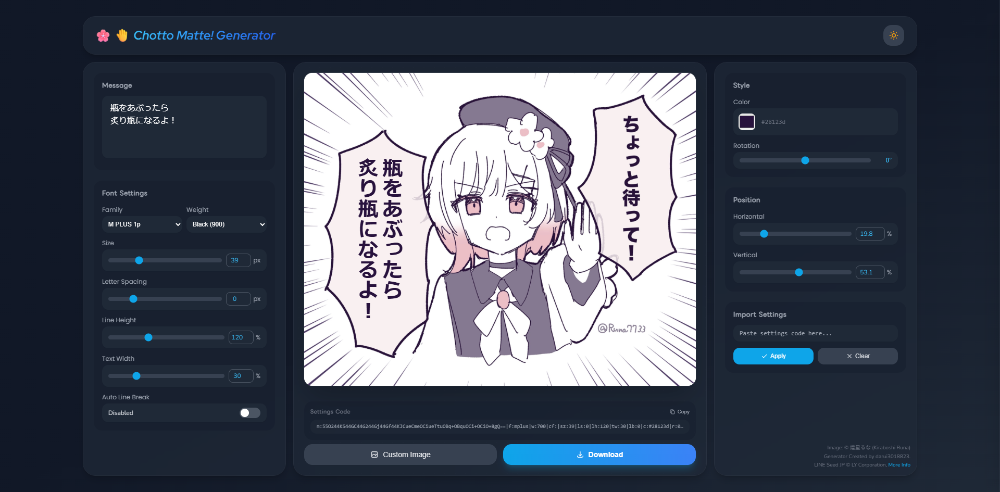

# Chotto Matte! Generator

> [English version / 英語版はこちら](../README.md)

<table>
<tr>
<td width="50%">


<p align="center"><em>ページのイメージ</em></p>

</td>
<td width="50%">


<p align="center"><em>カスタマイズ例</em></p>

</td>
</tr>
</table>

画像の上に縦書きテキストを載せるワンページアプリです。フォント・文字組み・位置・テーマを細かく調整でき、設定コードを共有して同じレイアウトを再現できます。

## 主な機能
- プレビュー画像上でのライブ縦書きテキスト表示
- フォント選択（ヒラギノ、M PLUS 1p、Noto Sans JP、システム、カスタム Google Fonts）とウェイト切替
- 文字サイズ・字間・行間・テキスト幅・位置・回転・色の調整
- 自動改行の ON/OFF 切替（改行保持 or ラップ）
- カスタム背景画像のアップロード、ライト/ダークテーマ切替
- 設定コードの生成とインポートでレイアウトを共有・復元
- LINE Seed JP と Google Fonts のライセンスビューア

## 技術スタック
- HTML + Tailwind CDN（テーマ拡張は [js/twcss_conf.js](./js/twcss_conf.js)）
- UI ロジックはバニラ JS の [js/script.js](./js/script.js)
- フォント定義と補助スタイルは [css/styles.css](./css/styles.css)
- 静的ファイルを配信する Go サーバーは [server.go](./server.go)

## 動かし方
1) Go をインストール（1.21+ 推奨）。
2) プロジェクトルートで `go run server.go` を実行。
3) ブラウザで http://localhost:8080 を開く。

※ `go build server.go` でバイナリを作って実行することもできます。

## 使い方のヒント
- Message ボックスに文章を入力すると縦書きで反映されます。
- フォントとウェイトを選択。カスタムの場合は Google Fonts の正確なファミリー名を入力します。
- サイズ、字間、行間、テキスト幅、回転、位置をスライダー/数値で調整します。
- Auto Line Break で改行方式を切り替えます。
- 色を選ぶと隣に HEX 値が表示されます。
- 背景を変えたい場合は Custom Image で画像をアップロードします。
- Settings Code をコピーして共有し、インポート欄に貼って Apply すると復元できます。
- テーマボタンでライト/ダークを切り替えられます。

## 設定コードのキー対応
```
m: メッセージ（UTF-8 を Base64 化）
f: フォントキー（hiragino | mplus | noto | system | custom）
w: フォントウェイト
cf: カスタムフォント名（Google Fonts 用）
sz: フォントサイズ(px)
ls: 字間(px)
lh: 行間(%)
tw: テキスト幅(%)
lb: 自動改行（1 有効 / 0 無効）
c: 色の HEX
r: 回転(度)
x: 水平位置(%)
y: 垂直位置(%)
```

## 設定コード共有時の互換性について

設定コードを使ってレイアウトを共有する場合、以下の環境を基準に作成されています。

- **画面解像度**: 1920×1080
- **ブラウザヘッダー**: 約90px（ブックマークバー非表示）
- **タスクバー**: Windows 11 標準の47px

**動作確認済みブラウザ**（いずれもブックマークバー非表示）:
- Google Chrome
- Mozilla Firefox
- Microsoft Edge (Chromium)

> 💡 タスクバーの高さについては多少の余裕を持たせて設計しているため、50px程度までであれば問題なく表示されます。一般的な Windows の設定であれば、特別な調整なしにほぼ同じレイアウトで共有できます。

## 補足と既知の制限
- Tailwind は CDN と小さな設定のみでビルド工程は不要です。
- LINE Seed JP はローカル同梱、その他のフォントは Google Fonts CDN から取得します。

## フォントとライセンス
- LINE Seed JP は [fonts](./fonts) 配下（ライセンスは [fonts/OFL.txt](./fonts/OFL.txt)）。
- M PLUS 1p / Noto Sans JP / Nunito Sans / Poppins / Red Hat Display は Google Fonts 由来で、SIL Open Font License 1.1 です（[fonts/ofl_license.txt](./fonts/ofl_license.txt) を参照）。
- 追加のクレジットや全文はアプリ内の Font Licenses パネルに表示されます。

## ライセンスについて
- 本プロジェクトのソースコード（HTML/CSS/JavaScript/Go）は BSD-2-Clause でライセンスされます（[LICENSE](./LICENSE) を参照）。
- サードパーティ素材（フォント、絵文字など）とそのライセンスは [Notice.md](./Notice.md) に記載しています。
- 画像は本人の許可を得て使用しており、再頒布を固く禁じます。詳細は [License.md](../License.md) をご覧ください。
